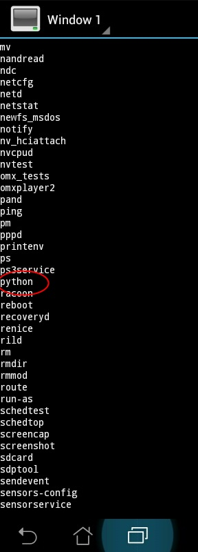
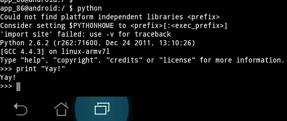

```eval_rst
:heading: /var/log/mike
:subheading: Mike's Blog
:doc_type: blog

:orig_link: https://mikemabey.blogspot.com/2012/06/pydroid-at-last.html
:tags: Android, Ice Cream Sandwich, Linux, Python, Python on Android, Terminal Emulator, Transformer Prime
:day: 6
:month: 6
:year: 2012
```
# Pydroid at last!

Well, hello there, my little friend! So good to see you where I had given up hope you would ever be:

<center>

</center>

So just a few minutes ago, I was poking around on my Asus Transformer Prime using the old reliable [Terminal
Emulator](https://play.google.com/store/apps/details?id=jackpal.androidterm) and ran `ls /system/bin` just to see what
kind of executables were there, and lo and behold there was Python installed! I was a bit surprised to see it, since I
haven't done anything to modify the default installation of Ice Cream Sandwich from the factory, but here's the evidence
that it runs:

<center>

</center>

There are a few things to take note of here. First, it's running Python 2.6.2, which is a little dated since as of this
writing, the 2.6 series is up to 2.6.8, which was released April 10 of this year. So that means there are a number of
security patches absent, but I'll likely only be running my own code on here. Still, I wish I could have some of the
new features from 2.7 like the multiple clause support in the `with` statement to do things like this:

```
with open(file1) as var1, open(file2) as var2:
	... 
```

Second thing of note is the warning "Could not find platform independent libraries...", which may be a result of:

* Running Python from within an app, which all have limited permissions that may be preventing access to those libraries
* Terminal Emulator may need to be told to export the path to the libraries
* Something else that will undoubtedly be tedious to discover and fix

In any case, I'm one step closer to getting my tablet to completely replace my notebook, which I'm totally okay with.
