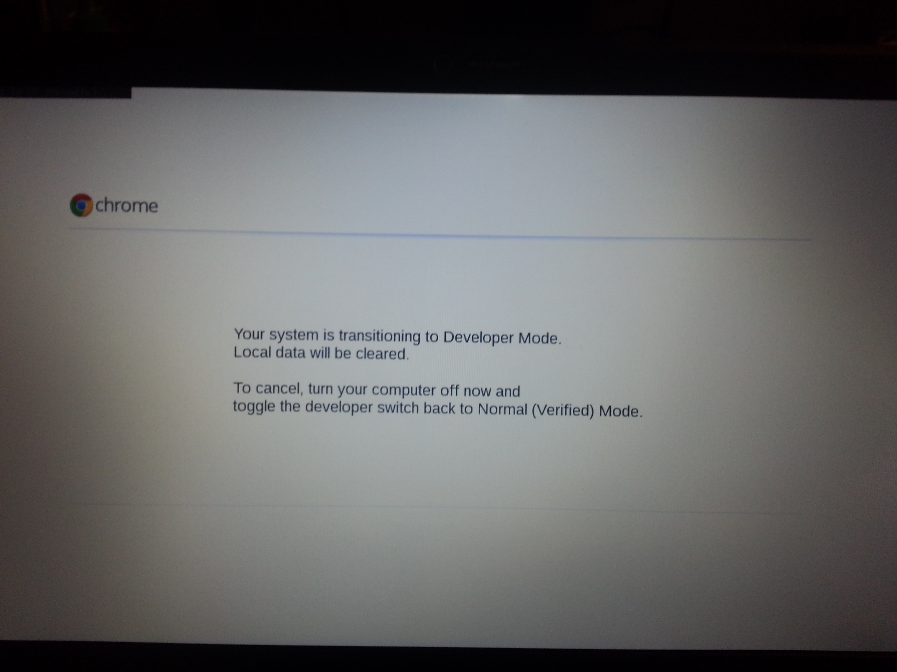
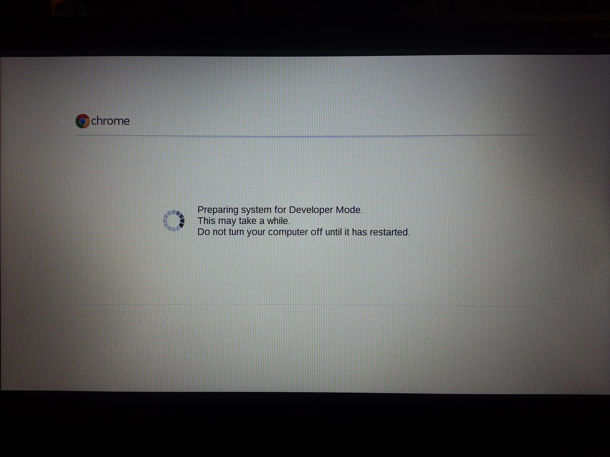

```{eval-rst}
:blogpost: true
:heading: /var/log/mike
:subheading: Mike's Blog
:doc_type: blog

:orig_link: https://mikemabey.blogspot.com/2013/05/getting-into-developer-mode-on-hp.html
:tags: Chrome OS, Chromebook, Chromium, Crouton, developer mode, HP Pavilion Chromebook, repair manual, WP switch
:date: 2013-05-08
:title: Getting into Developer Mode on the HP Pavilion 14 Chromebook
```
# Getting into Developer Mode on the HP Pavilion 14 Chromebook

So I recently added the HP Chromebook to my cohort of tech gadgets, and naturally wanted to put the device into
developer mode. While the information posted on the [Chromium Wiki](http://www.chromium.org/chromium-os) about the [HP
Chromebook](http://www.chromium.org/chromium-os/developer-information-for-chrome-os-devices/hp-pavilion-14-chromebook)
was helpful, it turns out that it is incomplete. So below are my abbreviated instructions for getting it into developer
mode from start to finish. Another great resource is the HP repair manual, available
[here](http://www.manualbag.com/hp/hp-laptops/hp-pavilion-14-c010us-chromebook/).

## Step 0: Make sure you understand what you're getting into

Putting your Chromebook into developer mode bypasses some of the security mechanisms built into the operating system AND
will probably void your warranty. Also, you should be comfortable with taking electronics apart and have a suitable
working environment with ESD ([electrostatic discharge](http://en.wikipedia.org/wiki/Electrostatic_discharge))
protection. If you are comfortable with the risks involved, you'll need the following tools:

* Phillips screwdriver
* A wide flat head screwdriver
* Common sense (no substitutes accepted!)

Also, this process will completely wipe out any locally stored data, so move anything you want to keep to Google Drive
or somewhere else before proceeding.


## Step 1: Flip your switch

Following the guide from the [Chromium
Wiki](http://www.chromium.org/chromium-os/developer-information-for-chrome-os-devices/hp-pavilion-14-chromebook), open
up the Chromebook and flip the WP (write protect) switch. It may be helpful to refer to the HP repair manual mentioned
earlier, since it is more comprehensive and fills some of the holes in the wiki's instructions. Some tips from when I
did this:

* Be sure to keep an eye out for screws not mentioned or shown in the diagrams. If you try to remove any part and it
  isn't coming off, chances are you may have missed a screw.
* For removing the keyboard, a small Allen wrench (like 1.5 mm or 1/16") works great to poke through the holes in the
  back. (This is a method described in the repair manual but not in the wiki.)
* Keep the screws from the bottom of the Chromebook and the ones from underneath the keyboard separate. Since all of the
  screws have flat heads, try standing them on their heads to keep them from rolling around and potentially getting
  lost.

Once you've flipped the switch, put the Chromebook back together following the instructions in the reverse order. Then
you'll be ready for Step 2.

By the way the write protect switch is a protection mechanism that prevents the boot code from being changed. **Simply
switching it does not put your Chromebook into developer mode.** Hence, the need for...


## Step 2: Booting into developer mode

The steps for booting into developer mode are actually still on the Chromium Wiki, but under the page for the [Samsung
ARM Chromebook](http://www.chromium.org/chromium-os/developer-information-for-chrome-os-devices/samsung-arm-chromebook).
Essentially these steps are as follows.

### Step 2.1

First, this is your last chance to back up any data stored internally.  After the next couple of sub-steps, everything
on the internal storage will be deleted.

With the Chromebook turned off, hold down the Escape and Refresh (F3) keys and poke the power button. It will come up
with a screen that looks like this:


### Step 2.2

At the above screen, *press `Ctrl-D`*, which will bring you to the confirmation page warning you that proceeding will
erase all local data. Press Enter to continue.


Once it reboots, you'll see the "scary screen," which is just a warning that OS verification is off. This warning will
show up every time you reboot your Chromebook from now on (well, until you take it **out** of developer mode at least).
You can either:

1. wait for 30 seconds for the warning to go away, OR
2. press `Ctrl-D` to force it to boot.


### Step 2.3

Now you just need to wait for your Chromebook to finish its thing. It will give you one last chance to cancel the
transition before completely erasing all local data:



After the final warning times out, it will begin the last step of the process:



Once this is done, it will reboot with a completely cleaned version of the OS. You'll have to log in again and
re-download any files you want stored locally, but that's it, your HP Chromebook is now in developer mode!

For more information about what developer mode offers, check out the [Chromium
Wiki](http://www.chromium.org/chromium-os). Or to install Ubuntu using the same kernel as Chrome OS, check out the
[Crouton](https://github.com/dnschneid/crouton) project at GitHub.
