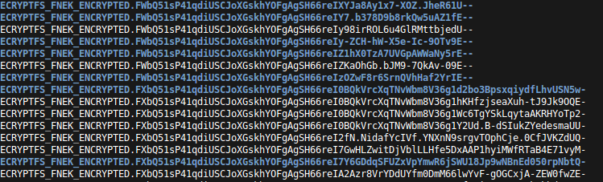

```eval_rst
:heading: /var/log/mike
:subheading: Mike's Blog
:doc_type: blog

:description: An explanation of how eCryptfs increases the lengths of filenames.
:tags: eCryptfs, encryption, padding, filesystems, file names, forensics, digital forensics
:day: 24
:month: 8
:year: 2017
:title: How eCryptfs Affects Filename Lengths
:datePublished: 2017-08-24T00:00:00
:dateModified: 2017-08-24T00:00:00
```
# How eCryptfs Affects Filename Lengths

If you've ever needed or wanted to know how long a filename will be when encrypted with eCryptfs, hopefully this gives
you an idea of some of the forces at work. I don't claim to be an expert in eCryptfs, but I did base all this
information on some pretty solid evidence.


## TL;DR

eCryptfs increases the length of a filename in a predictable pattern. Check the [table down below](#id1). If you know
the length of the unencrypted file `n`, find the row where `n` falls between the first two columns. The encrypted length
will be the right column of that row.


## Background

While doing research for my PhD, some of my work has included eCryptfs indirectly (I do research in digital forensics,
not cryptography or filesystems). At one point I was trying to predict the size of files after encryption, and the
biggest discrepancy between my predictions and the actual values was the directory entries. I had assumed that all
directories would occupy 4096 bytes on disk, but this didn't align at all with what I was seeing. At this point, I knew
I was making too many assumptions about the size of directories, but I didn't know how to calculate them better.

One day, while I was looking through the source code of eCryptfs, I realized that (1) the contents of a directory stored
to disk is a list of the files with their names and inode number, and (2) the names of all the files will be
particularly long because they're all encrypted by eCryptfs.

I knew that one variable I would need to take into account was that when eCryptfs encrypts a filename, the resulting
filename is padded, but still variable in length. So, I designed an experiment to figure out what the thresholds are
that cause the encrypted filenames to jump to the next length level. Check out the screenshot to see what I'm talking
about:



See how the length of the filenames is always a constant plus the multiple of some value?


## The Experiment

I wrote a Python script to create a file in the "upper" filesystem (unencrypted) and monitor the corresponding entry in
the "lower" filesystem (encrypted). My script created files with increasing filename lengths and then recorded what the
length of the filename was for the lower file. It did this thousands of times with randomly generated filenames,
including Unicode characters.

The results are summarized in the table below. The rows indicate what the length of the encrypted filename is for a
range of upper filename lengths. For example, if the unencrypted filename is between 80-95 characters long, the
encrypted filename will always be 188 characters. Since `ext4` limits any filename from having more than 255 characters,
the encryption process will fail for an unencrypted file with any more than 143 characters.

These ranges were very consistent in my experiment (which I ran several times), so I presently have no reason to believe
there are any edge cases that wouldn't fit into the table.

```eval_rst
.. table:: Thresholds for encrypted filenames.
   :class: right-align-all

   +-------------+-------------+---------+
   | Upper Min   | Upper Max   | Lower   |
   +=============+=============+=========+
   | 1           | 15          | 84      |
   +-------------+-------------+---------+
   | 16          | 31          | 104     |
   +-------------+-------------+---------+
   | 32          | 47          | 124     |
   +-------------+-------------+---------+
   | 48          | 63          | 148     |
   +-------------+-------------+---------+
   | 64          | 79          | 168     |
   +-------------+-------------+---------+
   | 80          | 95          | 188     |
   +-------------+-------------+---------+
   | 96          | 111         | 212     |
   +-------------+-------------+---------+
   | 112         | 127         | 232     |
   +-------------+-------------+---------+
   | 128         | 143         | 252     |
   +-------------+-------------+---------+
   | 144         | ???         | >255    |
   +-------------+-------------+---------+
```

```eval_rst
.. important::
    The first two columns above are the number of *bytes*, **not** *characters*. Of course, if you only have ASCII
    characters in your filenames, it will be the same. But for any Unicode characters that use more than 8 bits, you'll
    need to factor this in when calculating sizes.
```


## Extra Details - eCryptfs Filename Details

```eval_rst
.. note::
    The following are some notes I took while trying to understand the source code for eCryptfs. It might not make any
    sense, but I'm leaving it here just in case.
```


Take an example filename:

```
ECRYPTFS_FNEK_ENCRYPTED.FWbQ51sP41qdiUSCJoXGskhYOFgAgSH66reIZ1hX0TzA7UVGpAWWaNy5rE--
```

It has the following components:

```eval_rst
.. table::
   :class: right-align-second

   +------------------+----------+---------------------------------------------------------------+
   | Name             | Length   | Description                                                   |
   +==================+==========+===============================================================+
   | Prefix           | 24       | ``ECRYPTFS_FNEK_ENCRYPTED.`` (includes the period)            |
   +------------------+----------+---------------------------------------------------------------+
   | Packet Type      | 1        | Should always be ``F``, which is 70 in decimal, 0x46 in hex   |
   +------------------+----------+---------------------------------------------------------------+
   | Packet Length    | 1-2      | Depends on (?)                                                |
   +------------------+----------+---------------------------------------------------------------+
   | FNEK Signature   | 8        |                                                               |
   +------------------+----------+---------------------------------------------------------------+
   | Cipher code      | 1        | Number indicating the cipher used to encrypt the filename     |
   +------------------+----------+---------------------------------------------------------------+
   | …                |          |                                                               |
   +------------------+----------+---------------------------------------------------------------+
   | Filename         | n\*20    | Encrypted and encoded                                         |
   +------------------+----------+---------------------------------------------------------------+
```


The prefix is prepended to all filenames when both of the following are true (1) the option to encrypt filenames is on,
and (2) the same key isn't used to encrypt both the file contents and the filename.

`ECRYPTFS_FILENAME_MIN_RANDOM_PREPEND_BYTES`, defined to be 16


Seems even files have 8192 bytes prepended to their contents

```c
ECRYPTFS_TAG_70_MAX_METADATA_SIZE = 1+2+8+1+1
s->num_rand_bytes = 16+1
s->block_aligned_filename_size = s->num_rand_bytes + filename_size
max_packet_size = ECRYPTFS_TAG_70_MAX_METADATA_SIZE + s->block_aligned_filename_size
max_packet_size = 13 + 17 + filename_size
```

`max_packet_size` is later increased so as to be a multiple of the block size used by the chosen cipher
