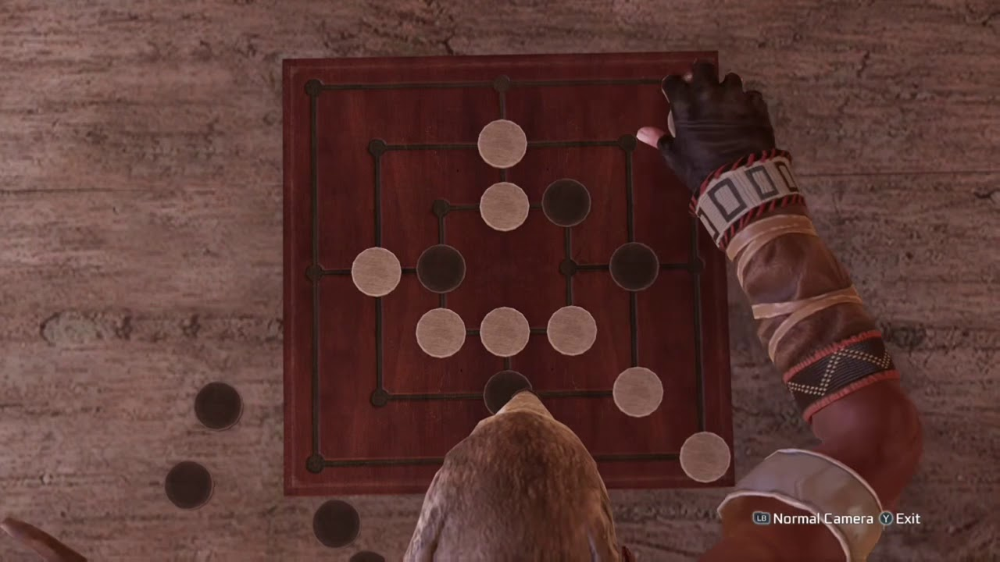

:blogpost: true
:heading: /var/log/mike
:subheading: Mike's Blog
:doc_type: blog

:description: Basic rules and strategies explained for the game Nine Men's Morris
:date: 2022-09-15
:title: Nine Men's Morris: Rules and Strategies

Nine Men's Morris: Rules and Strategies
=======================================

.. sidebar:: Contents

   .. contents::
      :local:
      :class: trimmed

For the last several months, I've been a bit obsessed with a game called Nine Men's Morris. Like a lot of other people
before me, I first learned of the game from playing it in one of the mini-games in `Assassin's Creed IV: Black Flag
<https://www.ubisoft.com/en-us/game/assassins-creed/IV-black-flag>`_.

   Where it all started for me.

Here are some things I really like about Nine Men's Morris:

- The rules are simple, so teaching it to a friend doesn't take very long. Even my three-year-old understands the
  mechanics and enjoys a game with me or his siblings.
- While it does require some strategy, it doesn't require the same level of foresight, planning, and brainpower as
  chess.

.. admonition:: Historical Note
   :class: three-col-ul

   Nine Men's Morris has been played for thousands of years; it is at least as old as the Roman Empire and was popular
   among Roman soldiers. It also may have been played as far back as 1400 BC in Egypt.\ [1]_

   Nine Men's Morris is also known as:

   - Nine-Man Morris
   - Mill
   - Mills
   - The Mill Game
   - Merels
   - Merrills
   - Merelles
   - Marelles
   - Morelles
   - Ninepenny Marl
   - Cowboy Checkers

-----

Basic Gameplay
--------------

   A blank Nine Men's Morris board with position notations.

The objective of the game is to do one of the following:

- Capture enough of your opponent's pieces that they only have 2 left. You capture an opponent's piece each time you
  form a :term:`mill`.
- Position your pieces such that your opponent has no more valid moves (all their pieces are trapped).

Gameplay consists of three main phases:

1. **Placement Phase**: Players take turns placing a piece on the board, starting with whichever player's pieces are
   white (or lighter in color).
2. **Movement Phase**: After both players have placed all nine of their pieces on the board, each player's turn consists
   of them moving a piece along a line from one :term:`position` on the board to an :term:`adjacent position`.
3. **Fly Mode**: An *individual* player reaches fly mode when they only have three pieces left, at which point they no
   longer need to move pieces to an :term:`adjacent position`. Rather, they can jump (or "fly") to any unoccupied
   :term:`position` on the board.

   .. important::

      Only the player with 3 pieces left enters Fly Mode, not both!

   Fly mode plays an important role in balancing the game. Since the player in fly mode will lose the next time their
   opponent makes a :term:`mill`, having this extra ability gives them more of a fighting chance at avoiding defeat.

Game Terms
----------

.. glossary::

  Mill
    Three pieces in a row along a single line on the board. Creating a mill at *any point in the game* (including the
    *Placement Phase*) permits you to remove one of your opponent's pieces from the board, provided:

    1. The piece you remove is *not* part of a mill, or
    2. If **all** of your opponent's pieces are part of a mill, you can remove any piece.

    .. hint::

       You can re-form a mill any number of times in a game. Arranging your pieces so that you are re-forming mills with
       every move is a very powerful position to be in!

  Position
    A location on the board indicated by a circle. Positions are the only valid places for pieces during gameplay. Only
    one piece can occupy any position at a time.

  Adjacent Position
    Any two :term:`position`\ s on the board are considered *adjacent* if they are connected by a line.

Game Strategies
---------------

.. admonition:: Come Back Soon!
   :class: attention

   I will post details on strategies soon.

FAQ
---

.. admonition:: Can a mill wrap around a corner?
   :class: tip question

   No, pieces making a :term:`mill` must all be along a single straight line.

.. admonition:: Where does the word "Morris" come from?
   :class: tip question

   The Latin word *merellus* means 'gamepiece', which may have been corrupted in English to 'morris', while *miles*
   is Latin for 'soldier'.\ [1]_

.. Admonition colors

   .. blue

   .. note:: blah

   .. green

   .. hint:: blah

   .. important:: blah

   .. tip:: blah

   .. yellow

   .. attention:: blah

   .. caution:: blah

   .. warning:: blah

   .. red

   .. danger:: blah

   .. error:: blah

.. [1] *Source:* `Wikipedia <https://en.wikipedia.org/wiki/Nine_men%27s_morris>`_
