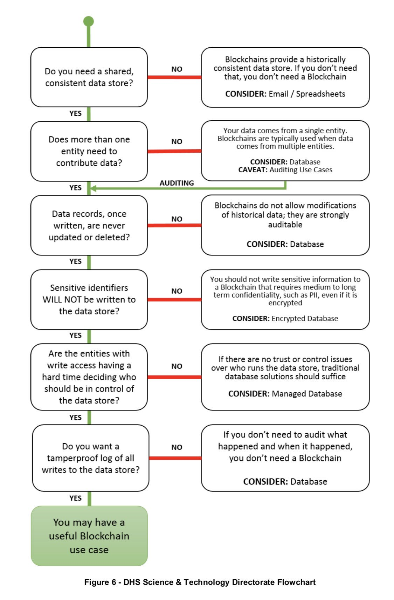

:heading: CSE 469 Computer and Network Forensics
:subheading: Spring 2019

==========================================
Group Project: Blockchain Chain of Custody
==========================================

:Due Date: April 25
:Done By: Groups
:Checkpoint: March 28

The Chain of Custody form is a critical element to a forensic investigation because examiners use it to record the
history of the evidence from the time it is found until the case is closed or goes to court. By keeping this record,
examiners can show that the integrity of the evidence has been preserved and not open to compromise. And in the
unfortunate event that evidence *does* become contaminated, the chain of custody will clearly identify the responsible
individual.

A Chain of Custody form keeps track of three pieces of important information (in addition to all the details that
uniquely identify the specific piece of evidence):

1. **Where** the evidence was stored.
2. **Who** had access to the evidence and **when**.
3. **What** actions were done to the evidence.

As an example, please refer to this generic chain of custody for from NIST:

- Regular URL: https://www.nist.gov/sites/default/files/documents/2017/04/28/Sample-Chain-of-Custody-Form.docx
- Google's cached version: https://webcache.googleusercontent.com/search?q=cache:EDTx4jL_PqQJ:https://www.nist.gov/document/sample-chain-custody-formdocx+&cd=1&hl=en&ct=clnk&gl=us

For this project, your group will write a program that will be a digital equivalent to a chain of custody form. Each
entry in the form will be stored in a `blockchain <https://en.wikipedia.org/wiki/Blockchain>`__ of your own creation.

Blockchain technology has been touted as a solution that will improve every aspect of digital communication. However,
real-world results have been `practically non-existent
<https://www.computerworld.com/article/3324359/blockchain/blockchain-what-s-it-good-for-absolutely-nothing-report-finds.html>`__. Consider the following flow chart that explores some use cases where a blockchain may be a good idea:

Considering that blockchains aren't suitable for very many use cases, this will largely be an academic exercise, but one
that I hope will be illustrative of how important it is to use the right tool for the job.

Requirements
------------

Your blockchain chain of custody program must implement the following commands::

   bchoc add -c case_id -i item_id [-i item_id ...]
   bchoc checkout -i item_id
   bchoc checkin -i item_id
   bchoc log [-r] [-n num_entries] [-c case_id] [-i item_id]
   bchoc remove -i item_id -y reason [-o owner]
   bchoc init
   bchoc verify

Where the parameters must conform to the following specifications:

|blockquote_options|

========  =================================================================
add       Add a new evidence item to the blockchain and associate it with
          the given case identifier. For users' convenience, more than one
          item_id may be given at a time, which will create a blockchain
          entry for each item without the need to enter the case_id multiple
          times. The state of a newly added item is ``CHECKEDIN``. The given
          evidence ID must be unique (i.e., not already used in the blockchain)
          to be accepted.
checkout  Add a new checkout entry to the chain of custody for the given
          evidence item. Checkout actions may only be performed on evidence
          items that have already been added to the blockchain.
checkin   Add a new checkin entry to the chain of custody for the given
          evidence item. Checkin actions may only be performed on evidence
          items that have already been added to the blockchain.
log       Display the blockchain entries giving the oldest first (unless ``-r``
          is given).
remove    Prevents any further action from being taken on the evidence item
          specified. The specified item must have a state of ``CHECKEDIN`` for
          the action to succeed.
init      Sanity check. Only starts up and checks for the initial block.
verify    Parse the blockchain and validate all entries.
========  =================================================================

|eblockquote|

   -c case_id
         Specifies the case identifier that the evidence is associated with.
         Must be a valid UUID. When used with ``log`` only blocks with the
         given ``case_id`` are returned.
   -i item_id
         Specifies the evidence item's identifier. When used with ``log`` only
         blocks with the given ``item_id`` are returned. The item ID must be
         unique within the blockchain. This means you cannot re-add an evidence
         item once the ``remove`` action has been performed on it.
   -r, --reverse
         Reverses the order of the block entries to show the most recent entries
         first.
   -n num_entries
         When used with ``log``, shows ``num_entries`` number of block entries.
   -y reason, --why reason
         Reason for the removal of the evidence item. Must be one of:
         ``DISPOSED``, ``DESTROYED``, or ``RELEASED``. If the reason given is
         ``RELEASED``, ``-o`` must also be given.
   -o owner
         Information about the lawful owner to whom the evidence was released.
         At this time, text is free-form and does not have any requirements.

Every block in the blockchain will have the same structure:

============= ====
Length (bits) Field Name - Description
============= ====
160           Previous Hash - SHA-1 hash of this block's parent
64            Timestamp - Regular Unix timestamp. Must be printed in ISO 8601 format anytime displayed to user.
128           Case ID - UUID stored as an integer.
32            Evidence Item ID - 4-byte integer.
88            State - Must be one of: ``CHECKEDIN``, ``CHECKEDOUT``, ``DISPOSED``, ``DESTROYED``, or ``RELEASED``.
32            Data Length (byte count) - 4-byte integer.
0 to (2^32)*8 Data - Free form text with byte length specified in ``Data Length``.
============= ====

When the program starts it should check if there are any existing blocks and create a block with the following
information if it doesn't find any:

- ``Previous Hash``: None, null, etc.
- ``Timestamp``: Current time
- ``Case ID``: None, null, etc.
- ``Evidence Item ID``: None, null, etc.
- ``State``: "INITIAL"
- ``Data Length``: 14 bytes
- ``Data``: The string: "Initial block"

All block data must be stored in a binary format. Plain text, JSON, CSV, and other similar formats are invalid for this
assignment.

All timestamps must be stored in UTC and account for the difference between local time and UTC.

Report
------

Just like in forensic investigations, your work on this project must be accompanied by a 5-page report, 12 point, 1.5
space, 1" margins. Include the following in the report:

- Requirements of the project in your own words. This will help you ensure you've captured all the details from above
  and understand what is expected.
- Design decisions made and why, including programming language, method of storing and parsing the blockchain, etc.
- Challenges you faced while working on the project and your solutions. Include any other lessons learned.
- Discussion on why a blockchain *is not* an appropriate choice for a production chain of custody solution.

I encourage you to include screenshot in your report, but know that they do not count toward your 5-page requirement, so
they should be part of an appendix and referenced accordingly in the text.

Checkpoint
----------

To help make sure you are on track to complete the project on time, you are required to submit an initial version of
your project by March 28 that includes the following functional elements:

1. ``bchoc init``
2. ``bchoc verify``

You are not required to submit a report for the checkpoint. All other submission guidelines apply.

Example
-------

Below are some example input/output for your program. Lines beginning with ``$`` are the input and everything else is
the output from the given command.

Initializing the blockchain::

   $ bchoc init
   Blockchain file not found. Created INITIAL block.

Checking the initialization::

   $ bchoc init
   Blockchain file found with INITIAL block.

Adding two new evidence items to a case::

   $ bchoc add -c 65cc391d-6568-4dcc-a3f1-86a2f04140f3 -i 987654321 -i 123456789
   Case: 65cc391d-6568-4dcc-a3f1-86a2f04140f3
   Added item: 987654321
     Status: CHECKEDIN
     Time of action: 2019-01-22T03:13:07.820445Z
   Added item: 123456789
     Status: CHECKEDIN
     Time of action: 2019-01-22T03:13:07.820445Z

Adding the same two evidence items, but one at a time (semantically equivalent to the above example)::

   $ bchoc add -c 65cc391d65684dcca3f186a2f04140f3 -i 987654321
   Case: 65cc391d-6568-4dcc-a3f1-86a2f04140f3
   Added item: 987654321
     Status: CHECKEDIN
     Time of action: 2019-01-22T03:14:09.750755Z
   $ bchoc add -c 135312414559765810732748806252319031539 -i 123456789
   Case: 65cc391d-6568-4dcc-a3f1-86a2f04140f3
   Added item: 123456789
     Status: CHECKEDIN
     Time of action: 2019-01-22T03:14:15.248161Z

Checking out an evidence item::

   $ bchoc checkout -i 987654321
   Case: 65cc391d-6568-4dcc-a3f1-86a2f04140f3
   Checked out item: 987654321
     Status: CHECKEDOUT
     Time of action: 2019-01-22T03:22:04.220451Z

Attempting to check out an evidence item twice without checking it in::

   $ bchoc checkout -i 987654321
   Error: Cannot check out a checked out item. Must check it in first.
   $ echo $?
   1

.. important::
   The last two lines of the above example ask the shell to print the return code of the most recently run program,
   meaning the command returned an error code when it exited.

Checking in an evidence item::

   $ bchoc checkin -i 987654321
   Case: 65cc391d-6568-4dcc-a3f1-86a2f04140f3
   Checked in item: 987654321
     Status: CHECKEDIN
     Time of action: 2019-01-22T03:24:25.729411Z

Looking at the last 2 entries in the log::

   $ bchoc log -r -n 2 -i 987654321
   Case: 65cc391d-6568-4dcc-a3f1-86a2f04140f3
   Item: 987654321
   Action: CHECKEDIN
   Time: 2019-01-22T03:24:25.729411Z

   Case: 65cc391d-6568-4dcc-a3f1-86a2f04140f3
   Item: 987654321
   Action: CHECKEDOUT
   Time: 2019-01-22T03:22:04.220451Z

Removing an item::

   $ bchoc remove -i 987654321 -y RELEASED -o "John Doe, 123 Cherry Ln, Pleasant, AZ 84848, 480-XXX-4321"
   Case: 65cc391d-6568-4dcc-a3f1-86a2f04140f3
   Removed item: 987654321
     Status: RELEASED
     Owner info: John Doe, 123 Cherry Ln, Pleasant, AZ 84848, 480-XXX-4321
     Time of action: 2019-01-22T03:24:25.729411Z

.. warning::
   Normally, you should be very careful about accepting user input that you later use and print to the screen. But for
   the purposes of this project, you don't need to worry about sanitizing input.

Verifying the blockchain::

   $ bchoc verify
   Transactions in blockchain: 6
   State of blockchain: CLEAN

Verifying the blockchain when it has errors::

   $ bchoc verify
   Transactions in blockchain: 6
   State of blockchain: ERROR
   Bad block: ca53b1f604b633a6bc3cf75325932596efc4717f
   Parent block: NOT FOUND

Or::

   $ bchoc verify
   Transactions in blockchain: 6
   State of blockchain: ERROR
   Bad block: 9afcca9016f56e3d12f66958436f92f6a61f8465
   Parent block: 99bcaaf29b1ff8dac2c529a8503d92e43921c335
   Two blocks found with same parent.

Or::

   $ bchoc verify
   Transactions in blockchain: 6
   State of blockchain: ERROR
   Bad block: 99bcaaf29b1ff8dac2c529a8503d92e43921c335
   Block contents do not match block checksum.

Or::

   $ bchoc verify
   Transactions in blockchain: 6
   State of blockchain: ERROR
   Bad block: e3f2b0427b57241225ba1ffc2b67fecd64d07613
   Item checked out or checked in after removal from chain.

.. note::
   For testing purposes, you can assume that a blockchain will only have one error in it. If this weren't the case, it
   would matter which direction you traverse the chain while validating, and I don't want you to have to worry about
   that.

Implementation
--------------

Your program must work on `Ubuntu 18.04 64-bit <http://releases.ubuntu.com/18.04/>`__ with the default packages
installed. You may find it helpful to set up a virtual machine to do your development. `VirtualBox
<https://www.virtualbox.org/>`_ is a free and open-source VM system.

If you wish to use packages that are not installed on Ubuntu 18.04 64-bit by default, please submit a file with your
code named ``packages``, with a list of packages that you would like installed before calling ``make``. Each line of
``packages`` must be a `valid package name <https://packages.ubuntu.com/bionic/>`__, one package per line. The submission
system will automatically install all the dependencies that the package lists.

For example, if you were going to write your assignment in `Haskell <https://www.haskell.org/>`_, you could install the
`GHC compiler <https://www.haskell.org/ghc/>`_ with the following ``packages`` file:

::

   ghc
   ghc-dynamic

We've created a `test script <hw1/test.sh>`_ called ``test.sh`` to help you test your program before compiling.

1. Download `test.sh <test script_>`_ to the directory where your code lives (including ``README`` and ``Makefile``).
2. Ensure that ``test.sh`` is executable: ``chmod +x test.sh``
3. Run: ``./test.sh``

Submission Instructions
-----------------------

You will need to submit your source code, along with a Makefile and README. The Makefile must create your executable,
called ``bchoc``, when the command ``make`` is run. Your README file must be plain text and should contain your name,
ASU ID, and a description of how your program works.

A prior TA compiled some resources on how to write a Makefile which might be helpful:

https://www.cs.swarthmore.edu/~newhall/unixhelp/howto_makefiles.html

Submission Site
---------------

Create an account to submit your assignment for all parts on the course submission site:
https://cse469s19.mikemabey.com/

.. |blockquote_options| raw:: html

   <blockquote class="options_table">

.. |eblockquote| raw:: html

   </blockquote>
